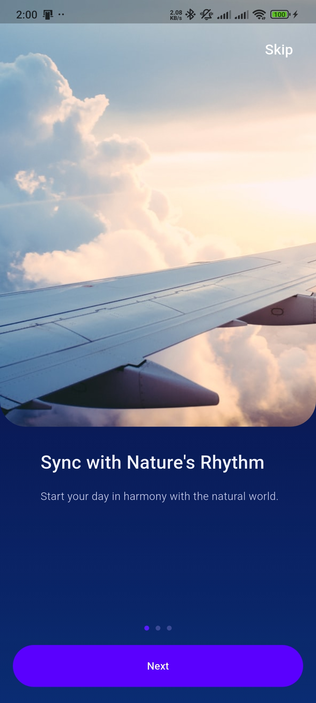
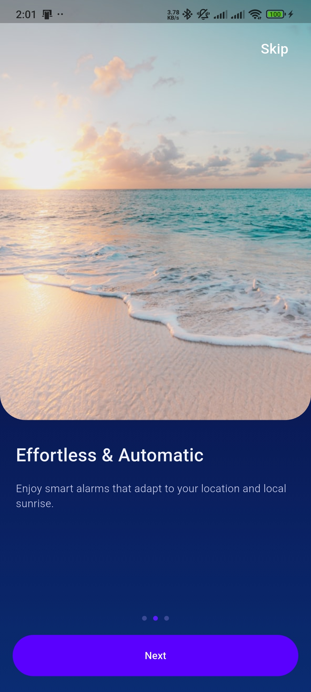
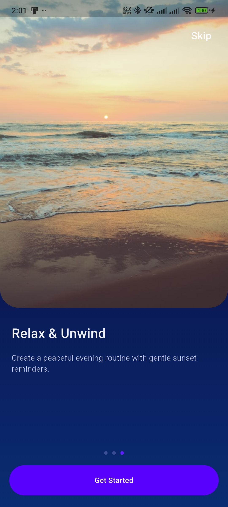
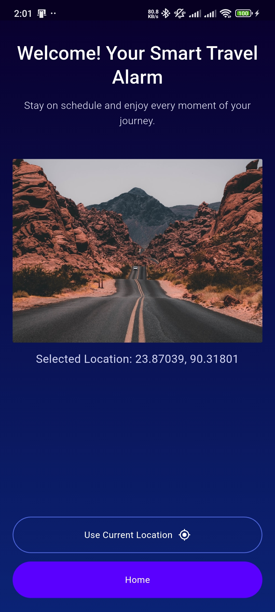
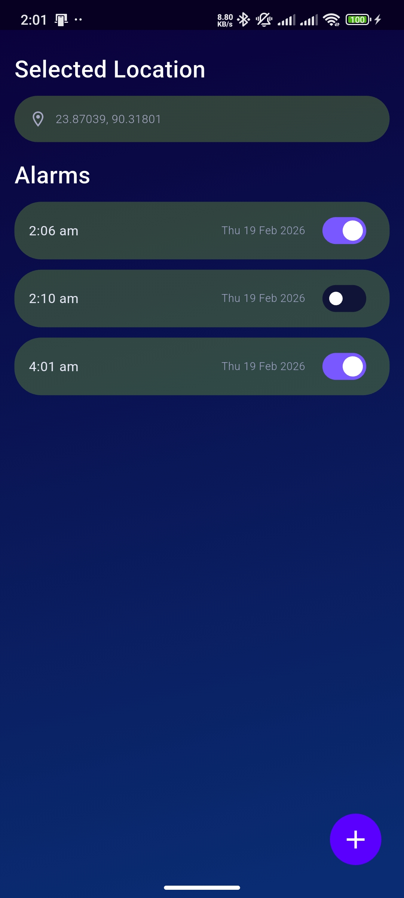

# Onboarding Alarm App

Flutter app with:

- 3-screen onboarding flow
- Location permission and current location fetch
- Alarm scheduling with local notifications
- Local alarm persistence

## Project Setup

1. Install Flutter SDK and run:

```bash
flutter doctor
```

2. Get dependencies:

```bash
flutter pub get
```

3. Run the app:

```bash
flutter run
```

## Tools / Packages Used

- `get`: State management and dependency injection
- `geolocator`: Location permission + current position
- `permission_handler`: Runtime permissions (location/notifications/alarm)
- `flutter_local_notifications`: Local alarm notifications
- `timezone`: Time-zone aware scheduling
- `sqflite`: Local database storage for alarms
- `shared_preferences`: Onboarding completion flag
- `intl`: Date/time formatting
- `path`: Database path handling

## Notes

- Android exact alarm and notification permissions are requested in app flow.
- Alarms are stored locally and restored on app launch.

## Screenshots

### Onboarding 1



### Onboarding 2



### Onboarding 3



### Location



### Alarm


